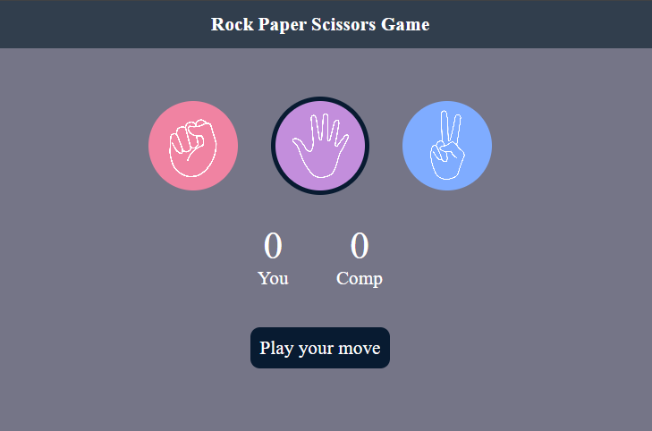

# 🪨📄✂️ Rock Paper Scissors Game

An engaging, scoreboard-powered **Rock Paper Scissors** game built with **HTML5, CSS3, and JavaScript**. Challenge the computer in real-time, keep track of your scores, and experience interactive gameplay.

---

## 🚀 Features

- **Smart Computer Move:** Computer choices are generated randomly using JavaScript logic for a fair game.
- **Real-time Scoreboard:** Live tracking of both the User's score and the Computer's score during the session.
- **Visual Choice Feedback:** Highlights the player's choice and shows instantly who won the round.
- **Clean Theme:** Minimalist buttons with clean click transitions and bright UI status colors.

---

## 🛠️ Tech Stack

- **HTML5:** Formatted the game choices and scoreboard widgets.
- **CSS3:** Styled custom hand-emoji cards and dynamic status text.
- **JavaScript (ES6):** Implemented comparative logic, random choice generator, and live score modifiers.

---

## 📸 Demo



---

## 📂 Project Structure

```text
├── index.html      # Scoreboard and action buttons
├── style.css       # Interactive animations and cards
└── script.js       # Round checking and scoring logic
```

<!-- git commit -m 'Add some AmazingFeature' -->
