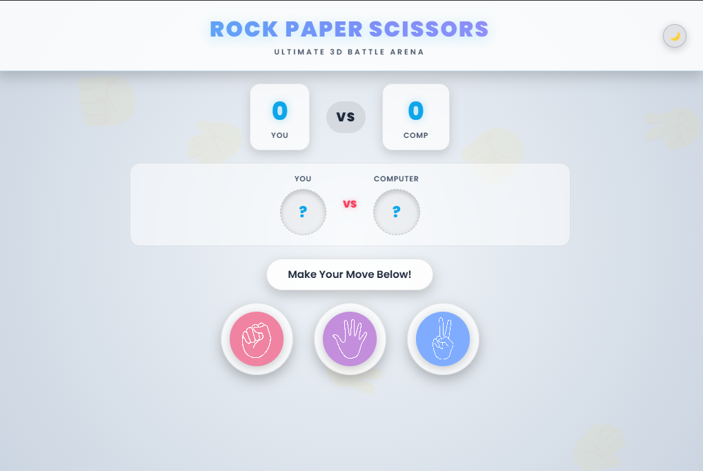

# 🪨📄✂️ Ultimate 3D Rock Paper Scissors Game

An engaging, scoreboard-powered **Rock Paper Scissors** game built with **HTML5, CSS3, and JavaScript**. Challenge the computer in real-time with an upgraded 3D glassmorphism user interface, centered header alignments, interactive battle arena, victory confetti particles, and a **Dark/Light Mode** toggle switch.

---

## 🚀 Features

- **Dark & Light Mode Switcher:** Easily toggle between dark and light themes with a single click[cite: 11].
- **Centered Layout & Header:** Perfectly centered game title, subtitle, and message status box for a balanced UI[cite: 11].
- **Dynamic Battle Arena:** Instantly displays what you and the computer selected side-by-side with animated shake effects[cite: 11].
- **Victory Particle Confetti:** Celebrates your wins with dazzling confetti animations using canvas-confetti[cite: 11].
- **Smart Computer Move & Scoreboard:** Real-time scoring and random choice generator for fair gameplay[cite: 11].

---

## 🛠️ Tech Stack

- **HTML5:** Structured the game choices, battle display arena, header, and theme switcher[cite: 11].
- **CSS3:** Styled custom glass cards, 3D shadows, keyframe animations, and theme variables[cite: 11].
- **JavaScript (ES6):** Implemented comparative logic, random choice generator, theme toggling, and confetti triggers[cite: 11].

---

## 📸 Demo



---

## 📂 Project Structure

```text
├── index.html      # Scoreboard, battle arena, header, and theme toggle
├── style.css       # 3D interactive animations, dark/light themes, and glassmorphism
└── script.js       # Round checking, scoring logic, theme switcher, and confetti effects
```
